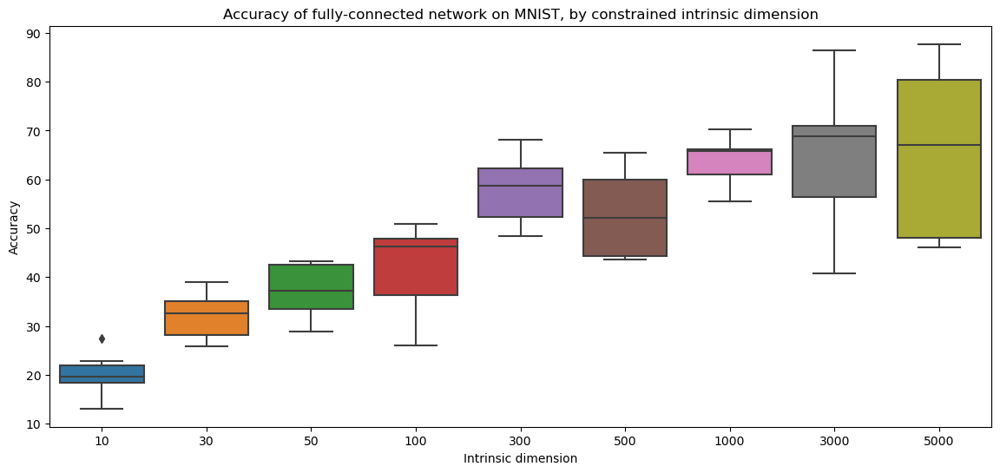

# Replicating "Measuring the Intrinsic Dimension of Objective Landscapes"

Determine the intrinsic dimension of objective landscapes for networks trained on MNIST, based on https://github.com/uber-research/intrinsic-dimension. Implemented in Pytorch and Python 3. The original work uses keras and Python 2. ([link to paper](https://arxiv.org/pdf/1804.08838.pdf), [link to blogpost](https://eng.uber.com/intrinsic-dimension/))

## Context

The intrinsic dimension of a dataset is effectively the minimum number of dimensions required to specify it. Neural networks are expected to have the capability to learn a dataset with reasonable performance, as long as it has sufficient capacity to house the intrinsic dimension of the dataset. 
 
## Concept

The core concept behind the paper is to constrain networks during training, such that the weights and biases of the entire network as a whole can only vary within a vector subspace with specified dimensions. By comparing the performance of the network over a range of dimensions, it is possible to infer the intrinsic dimension of the network's representation (i.e. objective landscape).

The paper accomplishes this by tying all weights and biases to a parameter vector, whose size defines the intrinsic dimension. Network weights and biases are frozen upon initialization, then projection matrices are randomly generated to map each layer to the parameter vector. The networks weights and biases are then replaced with the following formulation, which constrains network updates within the subspace defined by the random project matrices and the parameter vector:

$$ \theta ^ D = \theta_0^D + P \cdot \theta ^ d  $$

Where:
+ $\theta ^ D$: weights in its native dimension
+ $\theta_0 ^ D$: original initialized weights, frozen
+ $P$: randomly generated $D \times d$ projection matrix, frozen
+ $\theta ^ d$: parameter vector with specified dimension, updated during backprop

## Usage

Ensure you have these libraries installed: torch, torchvision, tqdm, matplotlib, pandas, seaborn.

Run `python mnist-intrinsic-dims.py` to train a fully-connected network and a convolutional network on MNIST at various constrained intrinsic dimensions. Note that this script takes ~8 hours to run. 

## Results

<!-- TODO later: add comparison with no subspace constraints -->

Running the provided script will save plots of network accuracy vs intrinsic dimension in the repo directory. Two sets of output will be saved: one for a fully-connected network with two hidden layers (dimensions: 784, 200), one for a convolutional network (LeNet). Both architectures are similar to those used in the paper.

`fc-results.PNG` below shows that the accuracy for the fully-connected network roughly plateaus around an intrinsic dimension of 1000. However, the resultant boxplot shows significant variation across 10 repeated trials, signifying that network training isn't particularly stable. This is reasonable given that a fully-connected network is used on a image dataset.

`conv-results.PNG` below shows that the accuracy for the convolutional network plateaus around an intrinsic dimension of 300. The boxplot shows that the accuracy across multiple trials are similar, indicating that network training is much more stable compared to the fully-connected network above. In addition to the lower intrinsic dimension, the overall accuracies attained are also higher than the fully-connected network at the same intrinsic dimensions.

## Comparison with the paper

The paper operationally defines intrinsic dimension to be the point where a network has 90% of the performance of the original, unmodified network. Using this definition, the authors found the intrinsic dimension of similar networks trained on MNIST to be 750 and 290 respectively. It is coincidentally close to the intrinsic dimension determined above, eyeballed off the plots at the point of plateauing.

There is one small difference: the authors observed that the variance in network performance at the same intrinsic dimension across multiple runs was minimal for fully-connected networks. The related plot above demonstrates the opposite. 

## Additional thoughts

The original repo wraps keras layers in custom projected layers, chiefly modifying the `add_weight` and `add_non_trainable_weight` methods to implement the subspace training constraint. I thought about deactivating the weights after initialization, but turns out that it isn't possible to [unregister a Pytorch Parameter](https://discuss.pytorch.org/t/how-to-unregister-a-parameter-from-a-module/36424/7). Ended up copying the source code of Pytorch layers and modified them directly, which is a clunky but fast way to implement the paper's concept.

Later came across [jgamper/intrinsic-dimensionality](https://github.com/jgamper/intrinsic-dimensionality) which implements a universal layer wrapper in Pytorch that works by manipulating Pytorch modules with well placed calls to `setattr` and `delattr`. 